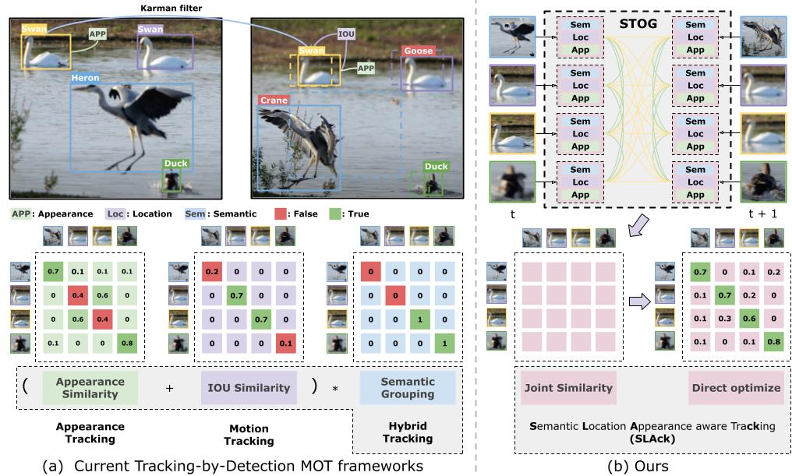

# SLAck: Semantic, Location, and Appearance Aware Open-Vocabulary Tracking [ECCV2024]
This repository contains the code for the paper:
[ [ArXiv](http://arxiv.org/abs/2409.11235) ]

[Computer Vision Lab, ETH Zurich](https://vision.ee.ethz.ch/)

## News and Updates
- 2024.07: SLAck is accepted by ECCV2024!

## Overview

Open-vocabulary Multiple Object Tracking (MOT) aims to generalize trackers to novel categories not in the training set. Currently, the best-performing methods are mainly based on pure appearance matching. Due to the complexity of motion patterns in the large-vocabulary scenarios and unstable classification of the novel objects, the motion and semantics cues are either ignored or applied based on heuristics in the final matching steps by existing methods. In this paper, we present a unified framework SLAck that jointly considers semantics, location, and appearance priors in the early steps of association and learns how to integrate all valuable information through a lightweight spatial and temporal object graph. Our method eliminates complex post-processing heuristics for fusing different cues and boosts the association performance significantly for large-scale open-vocabulary tracking. Without bells and whistles, we outperform previous state-of-the-art methods for novel classes tracking on the open-vocabulary MOT and TAO TETA benchmarks. 

    

## Code Release
The repo is under construction and will be released soon. Stay tuned!